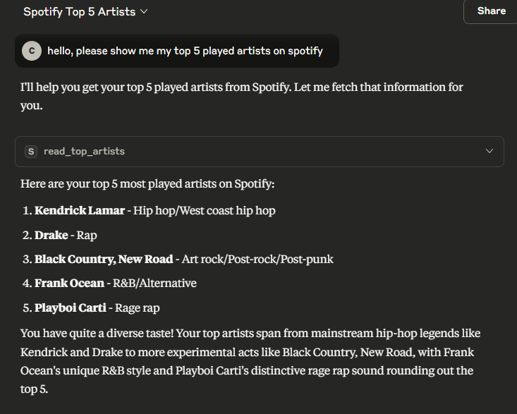

## spotify-mcp-server

An mcp server used to access info from your Spotify profile into your favourite LLM!

Have you ever wanted to broaden your music taste, but didn't want to endlessly search for recommendations based on your favourite artists? Now you can do that, with a single question asked to an LLM.

## Example:


## Tools:
- read_top_artists, read_top_songs - access your most listened to artists / tracks
- read_tracks, read_albums - access your saved albums and songs
- read_following - check which artists you're following

## Installation:
First, make sure you have [Docker](https://www.docker.com/) installed on your machine.

Then, head over to [Spotify for Developers](https://developer.spotify.com/dashboard) and add a new app:
- click `Create app`
- fill out the name and description - you can name it however you want
- set the redirect URI as `http://127.0.0.1:8000/callback`
- make sure to tick the `Web API` box
- click save, and you have your app created:

You're going to see a client ID and client secret - save them for later :)

Next, open your terminal, clone the repository and build it with docker:
```
git clone https://github.com/czajkub/spotify-mcp-server.git
cd spotify-mcp-server
docker build . -t spotify-mcp-server:latest
touch .env
```

Then, after creating a .env file in the main project directory, add your client ID and secret so it looks like this:
```
CLIENT_ID="<id>"
CLIENT_SECRET="<secret"
```

Congrats! You've set up the mcp server, now all you need to do is authenticate with oauth2.

If you're using uv, you can simply do the following:
`uv run app/auth/oauth.py`

If you're not redirected to the authentication page, open `http://127.0.0.1:8000/` on your browser and proceed with the instruction.


Now, for the last step: add the following into your [Claude Desktop](https://claude.ai/download)'s .json config file:

(click the three bars -> file -> settings, then click developer and edit config)

Make sure the file looks something like this:
```
{
	"mcpServers": {
		"spotify": {
			"command": "docker",
			"args": [
				"run",
				"-i",
				"--rm",
				"--init",
				"--name",
				"spotify-mcp-server",
				"spotify-mcp-server:latest"
			]
		}
	}
}
```

Now you're finally set to go - open Claude Desktop and you should be able to access all of your data!

